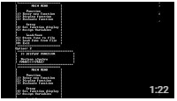

# uni-cplusplus-boolean-logic
Console based C++ expression logic application

### Overview
Your task is to design and implement a Circuit Diagram Editor that will allow the user to design, test and consequently simulate logic circuits. 

### Tasks
- A menu that provides options for basic file handling, moving and erasing, rotating/flipping of circuit widgets or selection of widgets in the current logic circuit view. 
- Control widgets for input, output and logic gates 
- Each input or output connector associated with a widget can be assigned a label. Connectors with no labels are referred to as anonymous connectors. The labels of the connector represents a signal variable that can either be high or low. 
- Controls to run simulations for the circuits for particular inputs. 
- The system should provide the user with different views of the circuits. (Boolean algebra, Tabular, Tree-based)

### Video

### Technologies
- C++
- Enterprise Architect (Diagrams)

### Programming Techniques
- OOP
- Design Patterns

### Docs
- [Specification](specification.pdf)
